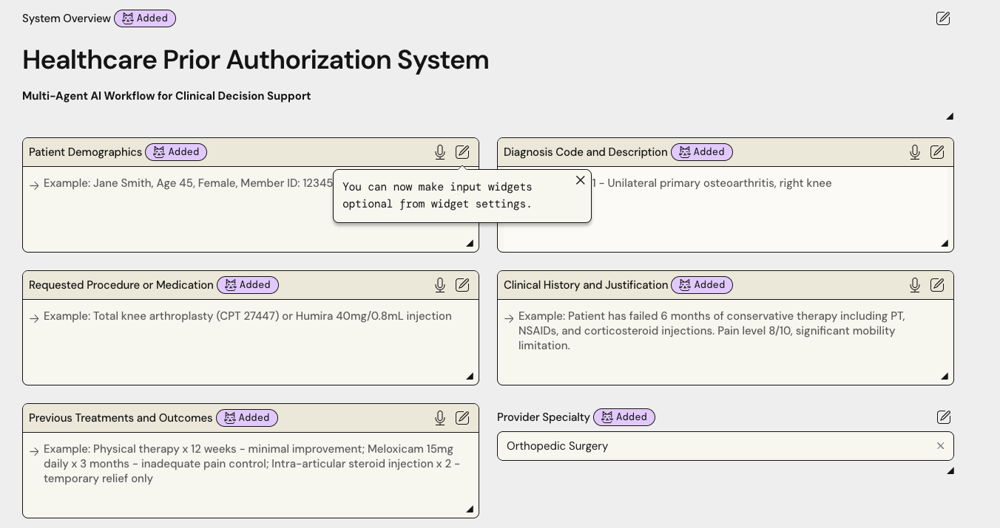
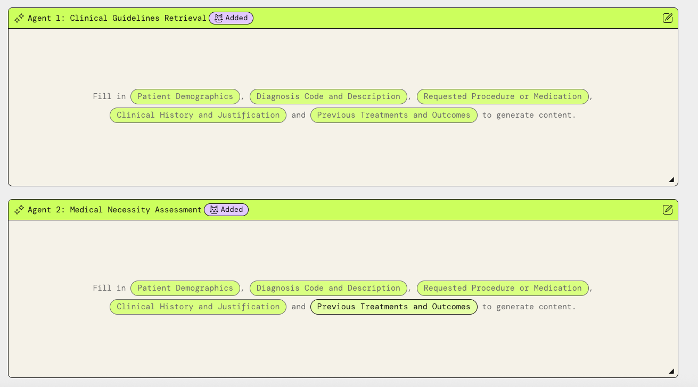
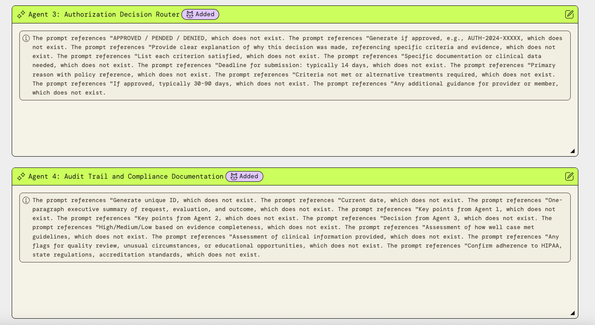
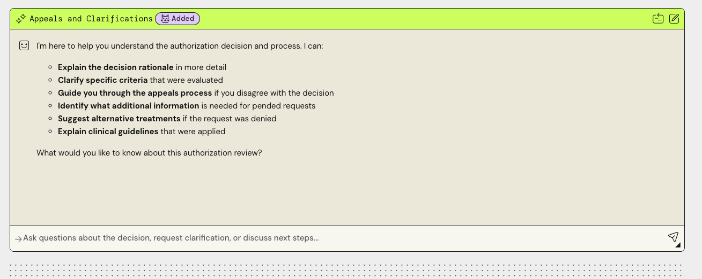

# AuthAgent — AWS-Native Healthcare Prior Authorization

[](LICENSE)
[](https://www.python.org/)
[](https://github.com/strands-agents/sdk-python)
[](https://aws.amazon.com/)

> Built by [Venky Krishnaswamy](https://theaiguru.dev)

---

<!-- AI-generated banner image goes here -->

---

## What It Does

AuthAgent automates healthcare prior authorization decisions using a 4-agent sequential pipeline built on **AWS Strands Agents SDK** + **Amazon Bedrock AgentCore** + **Claude 3 Haiku**.

Submit a prior authorization request — patient demographics, procedure code, diagnosis codes, clinical notes — and the agent pipeline queries clinical guidelines (LCD/NCD), assesses medical necessity, scores confidence 0–100, and routes to **APPROVED / PENDED / DENIED** in seconds.

- `score >= 75` AND complete documentation → `APPROVED`
- `score >= 75` AND missing info → `PENDED`
- `score < 75` → `DENIED`

100% serverless — ~$20–25/month at full capacity (3,100 requests/month).

---

## Screenshots

### Authorization Request Form


### Agent Pipeline — Clinical Guidelines Retrieval and Medical Necessity Assessment


### Authorization Decision Routing


### Appeals and Clarifications


---

## How the Agent Pipeline Works

Four specialized agents run sequentially, each handing enriched context to the next:

| Agent | Responsibility |
|-------|----------------|
| `OrchestratorAgent` | Validates input, coordinates pipeline, assembles final response |
| `ClinicalGuidelinesAgent` | Queries Bedrock Knowledge Bases (LCD/NCD RAG) for applicable coverage criteria |
| `MedicalNecessityAgent` | Scores medical necessity 0–100 against retrieved guidelines |
| `AuthorizationRouterAgent` | Applies decision thresholds, produces APPROVED / PENDED / DENIED with rationale |

---

## Key Features

- **4-agent Strands pipeline** — sequential orchestration via `AuthGraph` with explicit context passing between agents
- **Bedrock Knowledge Bases RAG** — LCD/NCD clinical guidelines indexed and retrieved per request; decisions grounded in documentation, not hallucination
- **Serverless architecture** — API Gateway + Lambda (Mangum) + AgentCore Runtime; scale-to-zero, no idle cost
- **Three-layer rate limiting** — API Gateway usage plans (100/day, 3,100/month) + DynamoDB atomic counters with `ConditionExpression` to prevent race conditions under concurrent load
- **Full audit trail** — complete per-agent conversation history in DynamoDB + CloudWatch OpenTelemetry trace link per request
- **HIPAA-conscious design** — `patient_id` SHA-256 hashed before storage or telemetry, clinical notes scrubbed from OTEL spans, DynamoDB encryption at rest
- **AWS CDK IaC** — 5 stacks covering API Gateway, Lambda, DynamoDB, Bedrock Knowledge Bases, AgentCore; reproducible single-command deploy

---

## Authentication, Access Control, and Security Mechanisms

AuthAgent has the most security layers of the three projects in this portfolio: three independent auth and rate-limiting mechanisms.

**Identity and Authentication**

- **AWS Cognito OAuth2 + JWT** — client credentials flow with mandatory MFA (OTP enforced), 12-character minimum password policy, and 1-hour access token expiry. Custom OAuth scopes are defined per operation: `authagent/submit`, `authagent/read`, `authagent/audit` — so a token scoped for reading cannot submit new requests.
- **API Gateway JWT Authorizer** — all agent-facing routes (`/authorize`, `/status`, `/decision`, `/audit`) require a valid Cognito Bearer token. Lambda never executes without a verified JWT. This enforcement is at the infrastructure layer, not in application code.

**Rate Limiting (Two Independent Layers)**

- **Layer 1 — API Gateway Usage Plans** — 100 requests/day, 3,100 requests/month, 10 req/s burst. Enforced before the request reaches Lambda.
- **Layer 2 — DynamoDB Atomic Counters** — per-IP counters with `ConditionExpression` checks to prevent race conditions under concurrent load. A request that slips past API Gateway throttling hits an independent DynamoDB counter that will reject it.

**Audit and Compliance**

- **Full Audit Trail** — complete agent conversation history (every agent turn, tool call, and intermediate output) stored in DynamoDB per request.
- **OpenTelemetry Trace Links** — each request emits OTEL traces to CloudWatch. The `/audit` endpoint returns the direct CloudWatch trace link for that specific request.
- **HIPAA-conscious data handling** — `patient_id` is SHA-256 hashed before any storage or telemetry. Clinical notes are never written to OTEL spans — only metadata. DynamoDB tables use AWS-managed encryption at rest.
- **Pydantic input validation** — all inputs validated against strict schemas; `patient_id` sanitized before reaching the pipeline.

**Defense-in-depth summary**: a request must clear a Cognito JWT check, an API Gateway usage plan, and a DynamoDB atomic counter before the agent pipeline executes. Three independent layers with no shared failure mode.

---

## Integration of AI Agents with External Systems and APIs

The agent workflow is triggered by external provider systems via a secured API Gateway endpoint. External systems don't just consume the output — they participate in the workflow through authenticated API calls.

- **AWS API Gateway + Lambda (Mangum)** — the entry point for external provider system integrations. Systems call `POST /authorize` with a Cognito Bearer token; Lambda validates, rate-limits, and invokes the `AuthGraph` pipeline. The async response pattern (202 Accepted + polling) means external systems integrate without blocking on multi-second LLM calls.
- **Amazon Bedrock AgentCore + Claude 3 Haiku** — `ClinicalGuidelinesAgent` and `MedicalNecessityAgent` call out to Bedrock for reasoning. The `AgentCore Runtime` handles agent execution, tool routing, and model invocation. Deploying to AgentCore (vs. running inline) provides production-grade scaling and model lifecycle management.
- **Bedrock Knowledge Bases (LCD/NCD RAG)** — clinical guidelines (LCD, NCD, CPT codes) are indexed in a Bedrock Knowledge Base backed by Amazon S3. `ClinicalGuidelinesAgent` retrieves the top matching guidelines via the Knowledge Base API on every request, grounding decisions in documented coverage criteria rather than parametric model knowledge.
- **DynamoDB** — two tables: a decisions table (final structured decisions, score, rationale, audit trail) and an audit table (per-agent-turn conversation history). Both are written by the agent pipeline and read back by the `/decision` and `/audit` endpoints. Rate limiting counters also live in DynamoDB.
- **CloudWatch + OpenTelemetry** — every agent step emits structured OTEL traces to CloudWatch. You can follow a single authorization request through the pipeline, node by node, in CloudWatch Insights.

---

## Architecture

```
POST /authorize
       |
  API Gateway (JWT Authorizer + Usage Plan: 100/day, 3,100/month)
       |
  Lambda (Mangum + FastAPI)
       |
  Rate Limiter (DynamoDB atomic counters — Layer 2)
       |
  AgentCore Runtime
       |
  AuthGraph (Strands sequential pipeline)
       |
  OrchestratorAgent
       |
  ClinicalGuidelinesAgent  -->  Bedrock Knowledge Bases (LCD/NCD RAG)
       |
  MedicalNecessityAgent    -->  Score 0-100
       |
  AuthorizationRouterAgent -->  APPROVED | PENDED | DENIED
       |
  DynamoDB (decisions + audit tables)
       |
  CloudWatch OTEL traces
```

---

## Cost Profile

~$20–25/month at full 3,100 request/month cap (Claude 3 Haiku). 100% serverless / scale-to-zero.

| Service | Monthly Cost |
|---------|-------------|
| Bedrock Claude 3 Haiku | ~$17 |
| AgentCore Runtime | ~$2–5 |
| DynamoDB + KB + S3 | < $2 |
| Lambda + API Gateway | ~$0 |

---

## Setup

### Prerequisites

- AWS CLI configured (`aws configure`)
- `uv` installed (`curl -LsSf https://astral.sh/uv/install.sh | sh`)
- AWS CDK v2 (`npm install -g aws-cdk`)

### 1. Install dependencies

```bash
cd authagent
uv sync
```

### 2. Deploy infrastructure

```bash
cd infra
pip install -r requirements.txt
cdk bootstrap
cdk deploy --all --require-approval never
```

Note the outputs: `KnowledgeBaseId`, `GuidelinesBucketName`, `AgentCoreRoleArn`.

### 3. Configure environment

```bash
cp .env.example .env
# Edit .env with CDK output values
```

### 4. Ingest clinical guidelines

```bash
uv run python scripts/ingest_guidelines.py \
    --bucket authagent-guidelines-<account-id> \
    --kb-id <knowledge-base-id> \
    --data-source-id <data-source-id>
```

### 5. Deploy AgentCore Runtime

```bash
uv run python scripts/deploy_agentcore.py \
    --bucket authagent-agentcore-deploy-<account-id> \
    --role-arn arn:aws:iam::<account>:role/authagent-agentcore-role \
    --kb-id <knowledge-base-id>
```

### 6. Run locally

```bash
RUN_INLINE=true uv run uvicorn authagent.api.main:app --reload --port 8000
```

---

## API Reference

### POST `/authorize`

Submit a prior authorization request.

```bash
curl -X POST https://<api-id>.execute-api.us-east-1.amazonaws.com/authorize \
  -H "Authorization: Bearer <cognito-token>" \
  -H "Content-Type: application/json" \
  -d '{
    "patient_id": "PATIENT-001",
    "procedure_code": "45378",
    "diagnosis_codes": ["K57.30", "Z12.11"],
    "clinical_notes": "55-year-old with rectal bleeding and family history of CRC.",
    "requesting_provider": "NPI-1234567890",
    "insurance_plan": "BlueCross-PPO-Gold"
  }'
```

Response: `{"request_id": "uuid", "status": "PROCESSING"}`

### GET `/status/{request_id}`

Check processing status.

### GET `/decision/{request_id}`

Returns full decision: score, guidelines cited, rationale, audit trail.

### GET `/audit/{request_id}`

Returns per-agent-turn audit with CloudWatch OTEL trace link.

---

## Sample Test Cases

### APPROVED (Score >= 75, complete documentation)

```json
{
  "procedure_code": "45378",
  "diagnosis_codes": ["K57.30", "Z12.11"],
  "clinical_notes": "55-year-old patient with rectal bleeding x 3 months, family history of colorectal cancer (father diagnosed at 52). Previous colonoscopy 7 years ago showed no polyps. Physical exam unremarkable except guaiac positive stool.",
  "requesting_provider": "Gastroenterology Associates",
  "insurance_plan": "BlueCross-PPO-Gold"
}
```

### PENDED (Score >= 75 but missing info)

```json
{
  "procedure_code": "27447",
  "diagnosis_codes": ["M17.11"],
  "clinical_notes": "Patient has knee pain. Reports difficulty walking.",
  "requesting_provider": "Orthopedic Surgery Center",
  "insurance_plan": "Aetna-HMO"
}
```

Expected: missing PT notes, X-ray reports, conservative treatment documentation.

### DENIED (Score < 75)

```json
{
  "procedure_code": "27447",
  "diagnosis_codes": ["M25.561"],
  "clinical_notes": "Patient wants knee replacement for mild discomfort.",
  "requesting_provider": "Primary Care Clinic",
  "insurance_plan": "Medicaid-Managed"
}
```

Expected: indication not established, requesting provider not a specialist.

---

## Tests

```bash
uv run pytest tests/unit/ -v
uv run pytest tests/integration/ -v
```

---

## Project Structure

```
authagent/
├── agents/          # Strands Agent definitions (4 agents)
├── graph/           # AuthGraph pipeline orchestration
├── tools/           # @tool functions: KB search, rate limiter, DynamoDB writes
├── api/             # FastAPI + Mangum Lambda handler
├── models/          # Pydantic schemas (request/response)
├── infra/           # AWS CDK stacks (5 stacks)
├── scripts/         # Ingestion + deployment scripts
└── tests/           # Unit + integration tests
```

---

## Related Work

This project is part of a portfolio of production-ready agentic systems:

- **[RiskScout](https://github.com/venkrishy/riskscout)** — financial document risk intelligence agent on Azure Container Apps using LangGraph + human-in-the-loop review + Cosmos DB for durable state
- **[CrewInsight](https://github.com/venkrishy/crewaimarketintelligence)** — competitive intelligence agent on Azure Container Apps using CrewAI + FinnHub + Azure AI Search for real-time market research

All three projects demonstrate production multi-agent orchestration, observability, and automated cloud deployment.

---

Built by [Venky Krishnaswamy](https://theaiguru.dev)
